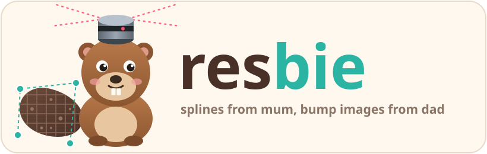

<p align="center"></p>

# resbie

> **RES**(PLE) + **BIE**(VR) = resbie. Nobody asked for this baby, and it's
> here anyway.

Two LiDAR-inertial odometry frameworks met in a [vendor folder](https://github.com/cosama/resbie/tree/main/core/vendor):

- **[RESPLE](https://github.com/ASIG-X/RESPLE)**: a continuous-time B-spline
  filter, the parent who keeps walking in the dark. Take away its points and
  it shrugs and keeps going on the IMU.
- **[BIEVR](https://github.com/S0UL4/BIEVR-LIO-SLAM)**: bump-image voxel maps,
  the parent who notices when a wall is 2 cm off and won't let it go.

resbie got RESPLE's spline brain and BIEVR's eyes. The two get along
surprisingly well, most of the time.

## Personality traits

- **Stubborn.** LiDAR goes dark? It keeps going on the IMU and usually
  comes out roughly where it went in. Usually.
- **Detail-obsessed.** It measures every point against sub-voxel height images,
  not some nearest-neighbour plane fitted in a hurry.
- **A terrible liar detector.** Every point is placed at its own timestamp,
  so if your LiDAR lies about time, resbie believes it and bends over
  backwards trying to make the lie work. Feed it honest point times.
- **Overeager.** Give it too many points and it reads too much into them.
  The default point filter (`points.downsample_m`, 0.25 m) keeps it calm;
  going much finer is asking for trouble.
- **Deterministic.** Same input, same output, bit for bit, however many
  threads you throw at it. Neither parent promised that out of the box,
  so this one it worked out on its own.

How the family actually works is in [`DESIGN.md`](DESIGN.md), for the
grown-ups.

## Feeding time

The whole API, in one sitting:

```python
import yaml
import resbie

# Every knob with its default. The only thing it can't guess is where the
# LiDAR sits on the IMU (LiDAR -> IMU, rotation row-major).
config = resbie.DEFAULT_CONFIG | {
    "calibration": {"translation": [0.0, 0.0, 0.1], "rotation": [1, 0, 0, 0, 1, 0, 0, 0, 1]}
}
yaml.safe_dump(config, open("resbie.yaml", "w"))

baby = resbie.Resbie("resbie.yaml", map_point_stride=10)  # keep every 10th point for a map

for msg in my_time_ordered_sensor_stream():  # bring your own sensors
    if msg.is_imu:
        baby.push_imu(msg.stamp, msg.acceleration, msg.angular_velocity)
    else:  # stamp = earliest point; times relative to it (honest ones, please)
        baby.push_lidar(msg.stamp, msg.points_xyzi, msg.relative_times)
    print(baby.latest_pose())  # [t, x, y, z, qx, qy, qz, qw], or None while it's waking up

baby.finish()  # bedtime: the last few sweeps get their poses

poses = baby.trajectory()              # (N, 8), one pose per sweep
keyframes = baby.keyframe_trajectory()  # loop-closed keyframes, if loop_closure.enable
scans = baby.drain_map_scans()         # [(stamp, (M, 4) xyzi)] deskewed, to build a map
diag = baby.sweep_diagnostics()        # how it felt about each sweep:
print(resbie.DIAGNOSTIC_COLUMNS)       #   points matched, IMU-only updates, sigma, ...
print(baby.status())                   # counters, biases, loop closures
```

Every call is synchronous: when a push returns, the thinking is done, and
the same input always gives the same output.

## Raise one yourself

Ask your coding agent of choice. resbie was raised by one, so it will
probably have an easier time with this than with any other SLAM framework
out there. Point it at `core/` (a pip-installable Python package with a C++
core) and `DESIGN.md`, and tell it to feed the baby IMU and LiDAR in time
order. Honest point timestamps only.

## Family tree

- **Mum:** [RESPLE](https://github.com/ASIG-X/RESPLE) by Ziyu Cao, William
  Talbot and Kailai Li ("RESPLE: Recursive Spline Estimation for LiDAR-Based
  Odometry", RA-L 2025). GPL-3.0, so resbie is GPL-3.0 too: see
  [`LICENSE`](LICENSE). It's in the genes.
- **Dad:** [BIEVR-LIO](https://github.com/ethz-asl/BIEVR-LIO) by Patrick
  Pfreundschuh, Turcan Tuna, Cedric Le Gentil, Roland Siegwart, Cesar Cadena
  and Helen Oleynikova, ETH Zurich ASL ("BIEVR-LIO: Robust LiDAR-Inertial
  Odometry through Bump-Image-Enhanced Voxel Maps", RSS 2026). BSD-3-Clause,
  notice kept in [`core/vendor/bievr/LICENSE`](core/vendor/bievr/LICENSE).
- **The fun uncle:** Iheb Soula, whose
  [BIEVR-LIO-SLAM](https://github.com/S0UL4/BIEVR-LIO-SLAM) fork brought the
  loop closer and Scan Context to the party. He forked dad one commit before
  dad put his license on, so the uncle showed up without one. We're
  assuming he meant dad's BSD-3, like any good uncle would.
- **Distant relatives:** Giseop Kim and Ayoung Kim, whose Scan Context
  (IROS 2018) the uncle reimplemented; nanoflann (BSD), unordered_dense (MIT),
  and helpers from basalt-headers and log++ (BSD-3), each with its license in
  its header.

## Credits

Written by Claude (Anthropic), in Claude Code, with great confidence and
the occasional wrong turn. Supervised by a human who kept saying "are you
sure?" at exactly the right moments.
